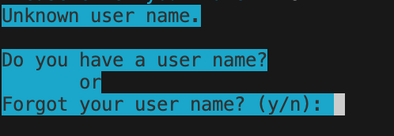
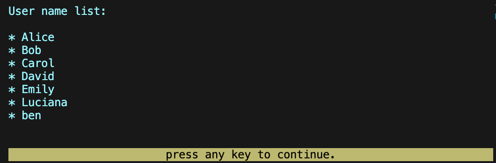
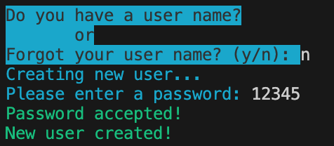
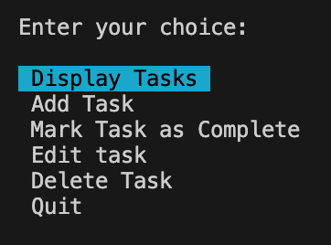
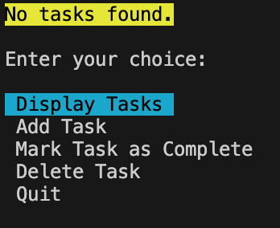
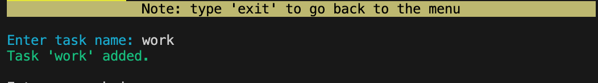
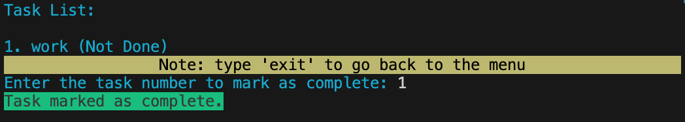
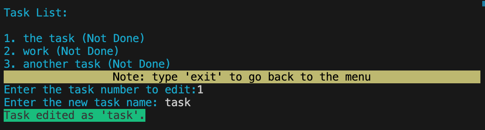
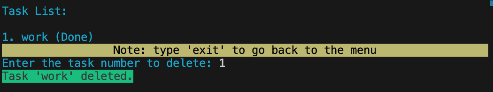
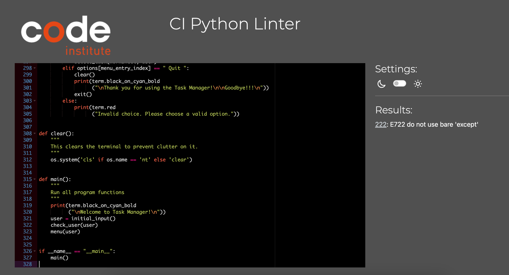

# Multi User Task Manager

 Multi User Task Manager for a family or small company that has the need of organizing and register their tasks.
 It is designed ir order for each user to have acces to their own set of tasks. If the tasks are to be shared a user name and pasword can be shared between user and every person involved can contribute with the tasks that have been done and add new ones.
 Multi User Task Manager  is a very useful tool for everyone that need some tasks management in their life

## Design and Inspiration
------
- I was inspired to make a task manager app from feeling the need of self organization. After some thought it came to my mind it would be much more usefull to make an app that could host several users. Each user having their own login it their specific tasks. I wanted to create an application that provided each user a confortable place to store their task list, be safe and accessible from anywhere with an internet connection.
- Below is the flowchart I created as a guide when I was first visualising how the code would be represented.

ADD CHART!!!!!

## How to use
------
Through the progression of the app, the user will go through the following:
- Login with your credentials (user name and password)
- If new user you will be redirected to a create new user path
- If user name was forgotten, the user ca ask for a list of all the user names
- After log in a menu will show with the list of options:
  - Display Tasks 
  - Add Task 
  - Mark Task as Complete
  - Delete Task
  - Quit 
- Through this self explanatory simple menu, the user will be alble to manage all the tasks they need.

## Features 
------

### Welcome message and LogIn
- Here the user can enter the user name and the password

- The app will then check with the spreadsheet where all the users and passwords are stored.

- If user is new or forgot user name the app will ask.

- If "y" is chosen a list of all the users will be shown and then redirected to the login again.

- If "n" is chosen a the app will create a new user after asking for a password, that will get stored in the spreadsheet. and an acceptance message is shown.

### Multi Choice Menu

- After login a multi choice menu will appear

### Display Tasks

- A list with all the tasks is shown. If no tasks exist, a message "No tasks found." is shown.

### Add Task

- Here the user is offered the option adding new task to their list. When the task is added there is a confirmation message.

### Mark Task as Complete

- A list of all the tasks is shown and the option to sellect which task to mark as complete is offered. When a task is selected there is a confirmation message that the task was marked as done.

### Edit Task

- A list of all the tasks is shown and the option to sellect which task to edit. Followed by an input the write the edited task name. When the task is edited there is a confirmation message that the task was successfully edited.

### Delete Task 

- A list of all the tasks is shown and the option to sellect which task to delete is offered. When a task is selected there is a confirmation message that the tasks was deleted.

### Quit

- A thank you message and a goodbye greetting is displayed. The app is closed.

### Input Validation
- All inputs have input validators, which ask the user for either a string, or "y" or "n", or an integer (whole number). 
- Please see [Testing](/TESTING.md) page for more detailed explanation of this.

MAKE THE TABLE!!!!

### Potential Future Features

- Add option to make users work within the same worksheet throught the same tasks.
- Add due date options to the tasks.

## Testing
------
### CI PEP8 Python Linter
- I checked all of my Python code through the Code Institute Python Linter, which came back with one message "222: E722 do not use bare 'except'". This except has to be bare in order for the code to run.

------
### For Manual Testing details, visit [Testing](/TESTING.md) page.
------

### Bugs

- **Problem 1**: At first I tried to make the app with google docs but it wasn't working properly. 
- ***Solution 1***: I changed it to googlesheets which was much more versatile and it started working.
- **Problem 2**: For a while the delete function was deleting the above task of what it was asked to do.
- ***Solution 2***: I changed targeted row by adding "1" and it fixed the problem.
- **Problem 3**: After installing simple_term_menu, the deployed version stopped working.
- ***Solution 3***: I updated the requirements and it started working.
- **Problem 4**: The add_task() was accepting empty strings wich would lead to an empty task.
- ***Solution 4***: I added an if statement to make it not accept empty strings.

### Unfixed Bugs

- None

## Mistakes
------

Mistake: I made a few of my git commits too long, by a few characters. 
- *Solution: Commit more often, with fewer changes to cover in a commit message* 

## Python Libraries Used and Why?
------
- `gspread`: I used gspread to access Google spreadsheets, where the data is being stored for this application. It is a library with useful data manipulation functions and allows us to access Google Sheets.
- `google-auth`: I used the Google Auth library to handle the Credentials for the API calls between the application and google sheets.
- `blessed`: I used blessed to give some color to the app and make it more appealing to the user
- `time`: I used time functions from the inbuild Python library to delay some function calls within the application. For example, when the user enters an input that causes an error, the application prints the reason why and then pauses for a few seconds before performing the function again. It enhances a good user experience.
- `simple_term_menu`: I used the simple_term_menu to make a multi-choice menu where the options can be selected by using the up and down arrows instead of using commands. This makes the app easier to use.
- `os`: I used "os" to make a simple function that would clean the terminal when necessary to prevent clutter.

## Credits 
------
### **Code**
Code credits are commented within the code, with a respective number referencing the numbers below.

1. Code Institute for the deployment terminal templates.

2. My mentor Alex was crutial in his support throughout this project, making suggestions and giving ideas that made this app way better.

### Helpsheets and Learning Resources

- [Blessed Documentation](https://blessed.readthedocs.io/en/stable/intro.html)
- [Gspread documentation](https://docs.gspread.org/en/latest/user-guide.html#)
- [Simple term menu documentation](https://pypi.org/project/simple-term-menu/)

